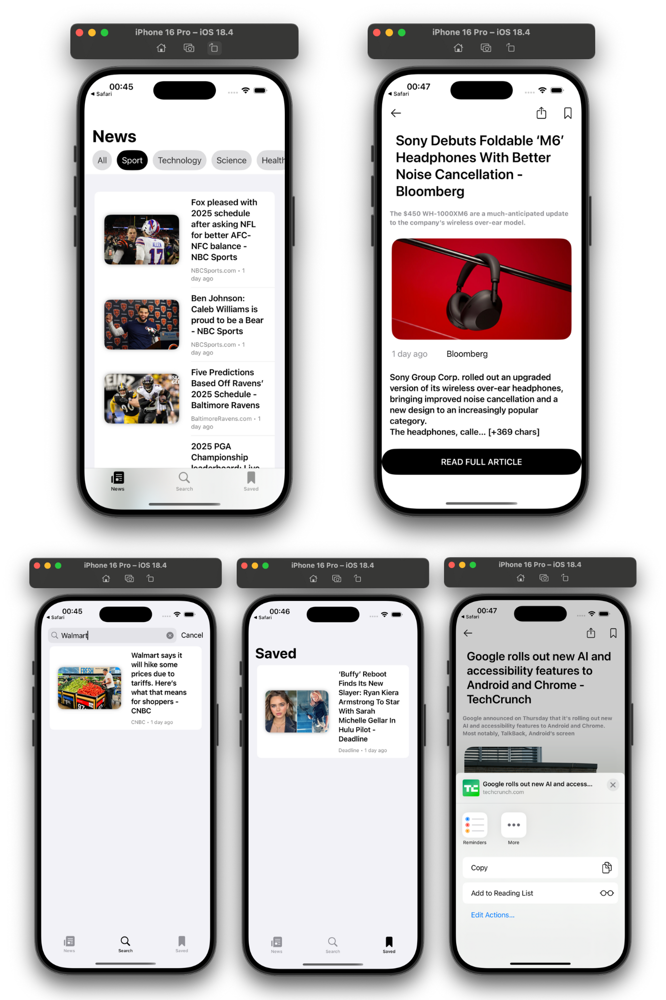

# 📰 NewsReader

A modern SwiftUI news app that fetches the latest headlines using the NewsAPI. The app is built with `SwiftUI`, `MVVM` architecture, and `async/await` for smooth and responsive networking.

## 📱 Features

- ✅ View top headlines in real-time
- ✅ Filter news by category (business, entertainment, health, etc.)
- ✅ Save news articles for later reading
- ✅ Share articles using the native `ShareLink`
- ✅ Open full articles in the browser
- ✅ Search functionality for quick access to specific news
- ✅ Smooth thumbnail loading with `AsyncImage`
- ✅ Built with Swift Concurrency and MVVM for clean architecture

---

## 🧠 Architecture

This project uses the **MVVM (Model-View-ViewModel)** architecture:

- `NewsManager` handles API requests using `async/await`
- `NewsListViewModel` prepares data for display
- Views observe ViewModels for real-time updates

---

## 🧰 Technologies Used

- `SwiftUI`
- `Combine` (via `@Published` and `ObservableObject`)
- `Async/Await`
- `Codable`
- `Link`, `ShareLink`
- `AsyncImage`
- `MVVM`
- [NewsAPI](https://newsapi.org)

---
## 📸 Screenshot

---

## 🚀 Future Features

- [ ] CoreData or SwiftData support to persist saved articles
- [ ] Offline reading mode
- [ ] Multi-country and language support
- [ ] Article bookmarks sync with iCloud
- [ ] Notifications for breaking news
- [ ] WidgetKit support for quick headlines
